# OpenBlaster

## Overview

A Linux desktop app for controlling Creative Sound Blaster cards (e.g. AE-5 Plus): mixer and card controls via
ALSA, RGB lighting, and HRTF-based virtual surround, with a tray icon.

It is a single Flutter/Dart application. There is no server and no native code of our own: it reaches the
card through `dart:ffi` bindings to the system's `libasound` (ALSA controls) and libc (`mmap` of the card's
BAR2 window for the LEDs).

## Screenshots

| Output | Speakers | Input |
|---|---|---|
| 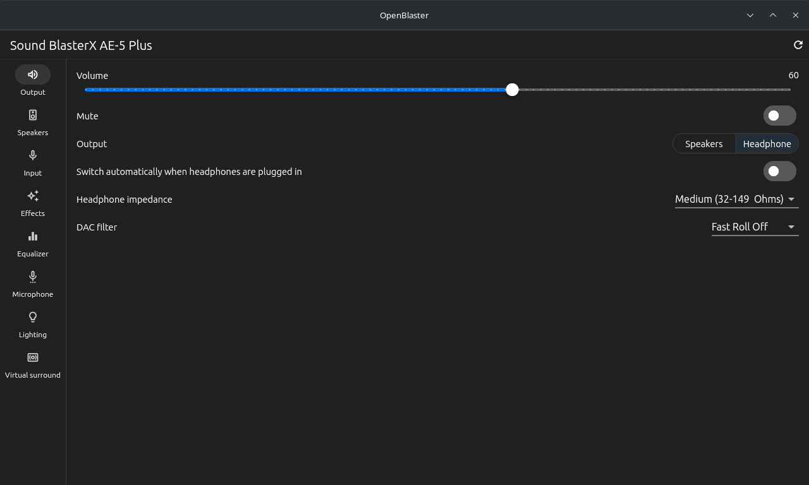 | 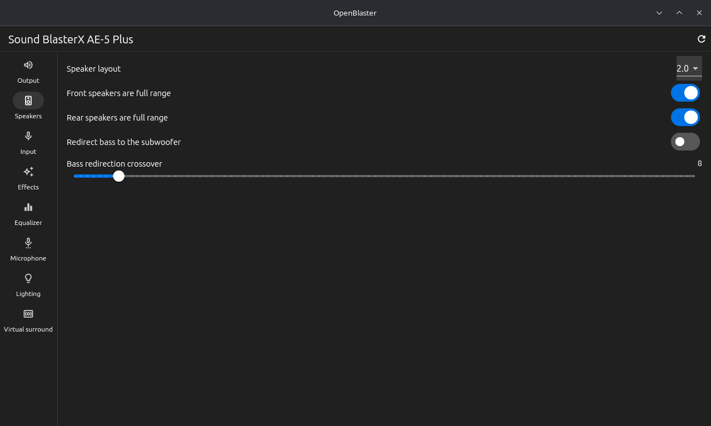 | 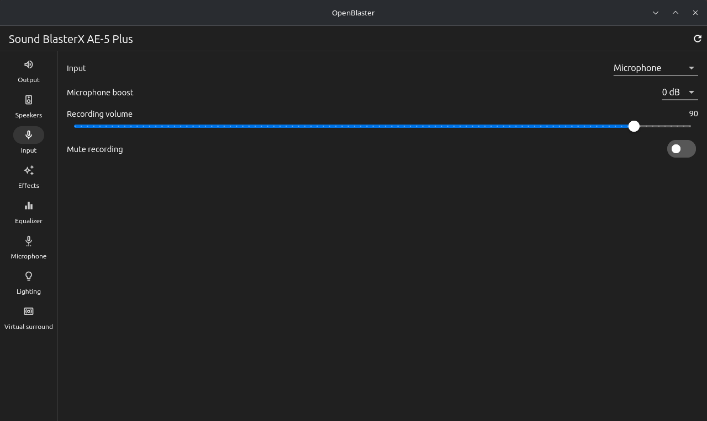 |

| Effects | Equalizer | Microphone |
|---|---|---|
| 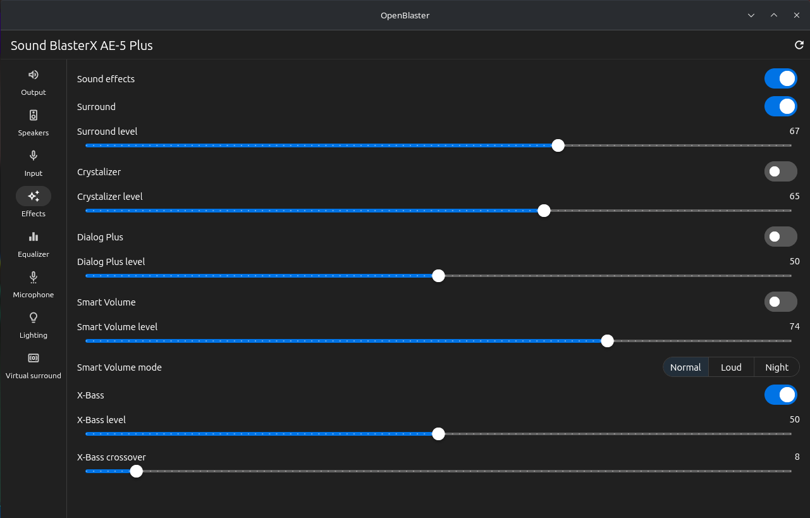 | 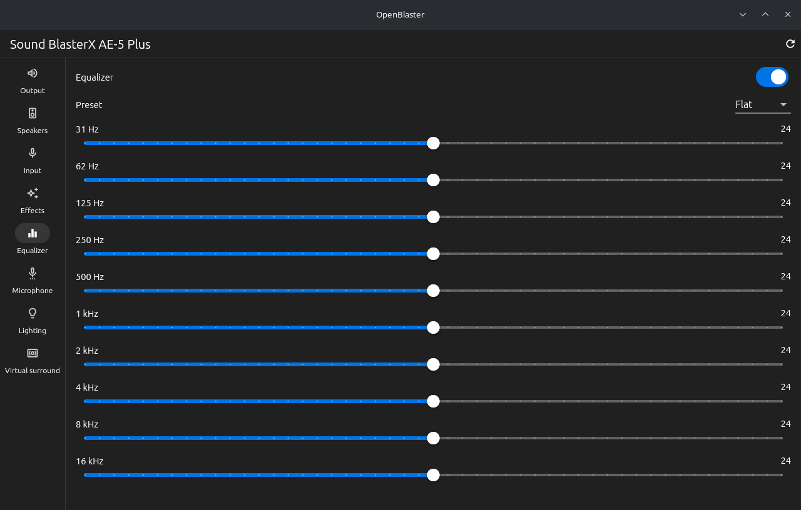 | 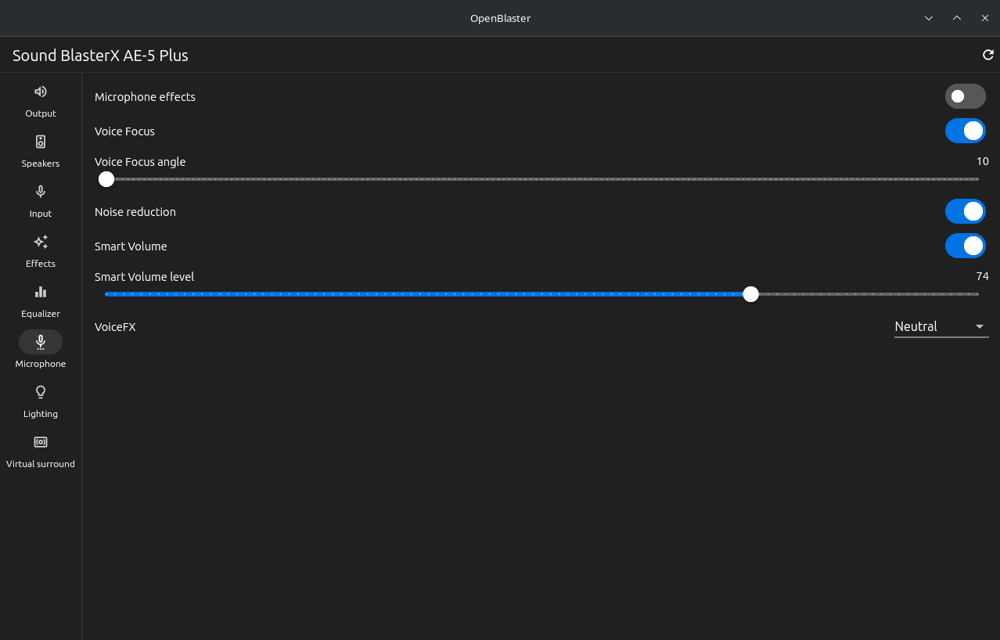 |

| Lighting | Virtual surround |
|---|---|
| 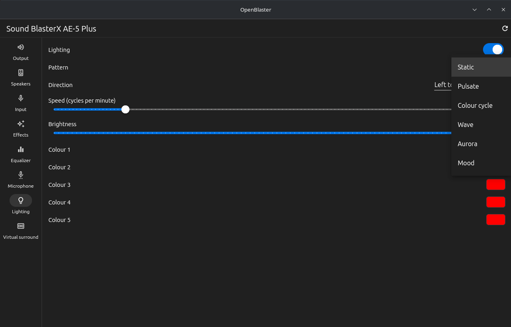 | 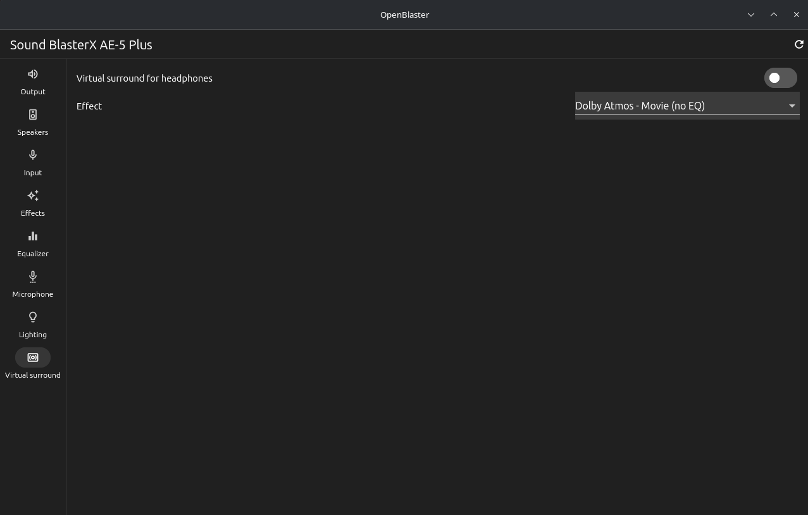 |

Virtual surround effects (HRTF impulse responses):

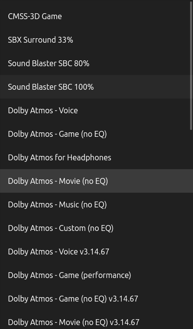
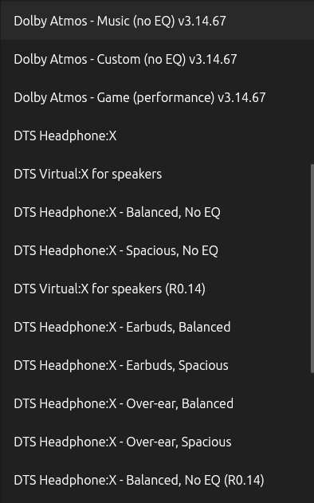
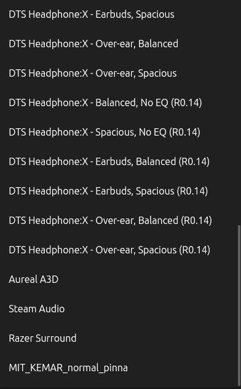

## Dependencies

- Flutter SDK with the Linux desktop toolchain (`flutter doctor`): CMake, Ninja, clang, GTK 3
- `libasound2` (ALSA) and `libayatana-appindicator3` (tray icon) at run time
- Pub packages (installed by `flutter pub get`): `dbus`, `ffi`, `yaru`, `tray_manager`, `window_manager`
- Lighting only: membership of the `audio` group and the udev rule in `install/70-openblaster.rules`

## Installation

Packages (`.deb`, `.rpm`, Arch `.pkg.tar.zst`, tarball) are attached to each GitHub release. They install the
udev rule; add yourself to the `audio` group and re-plug or reboot to enable lighting.

From source:

```sh
scripts/install.sh              # builds a release bundle and installs to /usr/local
scripts/install.sh /usr         # custom prefix (DESTDIR is honoured)
```

## Development

```sh
cd app
flutter pub get
flutter analyze && flutter test   # runs against in-memory hardware

scripts/dev-run.sh                # from the repo root: fake AE-5 Plus, nothing on your card changes
scripts/dev-run.sh --real         # your real card; changes real settings
```

App flags: `--background`, `--no-tray`, `--verbose`, `--demo`.

See [DEVELOPMENT.md](DEVELOPMENT.md) for the code layout, adding a control, the lighting permission and releasing.
HRTF files and their licensing are described in [hrtf/README.md](hrtf/README.md).

## Licence

OpenBlaster is free software: you can redistribute it and/or modify it under the terms of the GNU General Public
License as published by the Free Software Foundation, either version 3 of the License, or (at your option) any later
version. See [LICENSE](LICENSE). It comes with no warranty.
